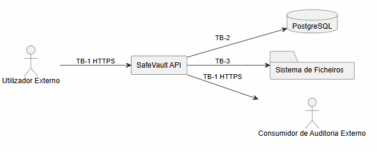
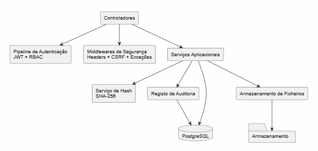
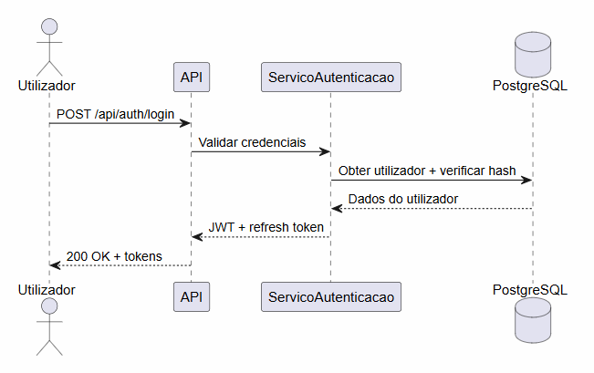
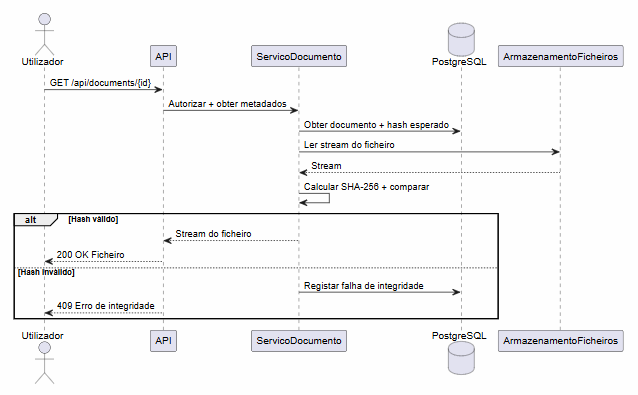
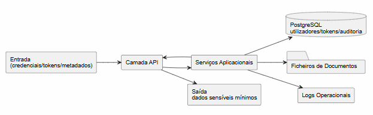

# Phase 1 - Assessment Readiness

Este documento consolida a evidencia necessaria para a avaliacao de M1 (Phase 1), com referencia directa aos criterios da rubrica 6.1 do enunciado do projecto. O seu objectivo e demonstrar que todos os requisitos da fase foram cumpridos e identificar os itens que transitam para Phase 2.

---

## 1. Cobertura da Rubrica 6.1

| Criterio | Peso | Estado | Evidencia principal |
|------|------|--------|------------|
| Organization and Language | 5% | OK | [phase1_deliverable.md](phase1_deliverable.md), [README.md](../../README.md) |
| Analysis | 10% | OK | [phase1_deliverable.md](phase1_deliverable.md) |
| Data Flow | 15% | OK | [phase1_deliverable.md](phase1_deliverable.md) |
| Threat Identification and Analysis | 20% | OK | [phase1_deliverable.md](phase1_deliverable.md) |
| Risk Assessment | 10% | OK | [phase1_deliverable.md](phase1_deliverable.md) |
| Mitigations | 10% | OK | [phase1_deliverable.md](phase1_deliverable.md), [phase1-traceability-matrix.md](phase1-traceability-matrix.md) |
| Requirements | 20% | OK | [phase1_deliverable.md](phase1_deliverable.md), [phase1-traceability-matrix.md](phase1-traceability-matrix.md) |
| Security Testing | 10% | OK | [phase1_deliverable.md](phase1_deliverable.md), [phase1-asvs-checklist.md](phase1-asvs-checklist.md), [phase1-traceability-matrix.md](phase1-traceability-matrix.md) |

---

## 2. Inventario de Evidencias por Ficheiro

| Tema | Evidencia |
|------|--------|
| Requisitos funcionais e nao-funcionais | [phase1_deliverable.md](phase1_deliverable.md) |
| Requisitos de desenvolvimento seguro | [phase1_deliverable.md](phase1_deliverable.md) |
| Abuse cases | [phase1_deliverable.md](phase1_deliverable.md) |
| Threat modeling STRIDE | [phase1_deliverable.md](phase1_deliverable.md) |
| Diagramas de fluxo de dados (DFD nivel 0, 1 e 2) e trust boundaries | [phase1_deliverable.md](phase1_deliverable.md) |
| Metodologia de avaliacao de risco e priorizacao | [phase1_deliverable.md](phase1_deliverable.md) |
| Mitigacoes e mapeamento tecnico | [phase1_deliverable.md](phase1_deliverable.md), [phase1-traceability-matrix.md](phase1-traceability-matrix.md) |
| ASVS de arquitectura | [phase1-asvs-checklist.md](phase1-asvs-checklist.md), [phase1_deliverable.md](phase1_deliverable.md) |
| Evidencia de controlos no codigo-fonte | [Program.cs](../../src/InterfaceAdapters/Program.cs), [SecurityHeadersMiddleware.cs](../../src/InterfaceAdapters/Middleware/SecurityHeadersMiddleware.cs), [DocumentService.cs](../../src/Application/Services/DocumentService.cs), [FileStorageService.cs](../../src/Infrastructure/Storage/FileStorageService.cs) |
| Evidencia de testes existentes | [DocumentServiceTests.cs](../../tests/ApplicationTests/DocumentServiceTests.cs), [CsrfTokenMiddlewareTests.cs](../../tests/InterfaceAdaptersTests/CsrfTokenMiddlewareTests.cs), [ExceptionHandlingMiddlewareTests.cs](../../tests/InterfaceAdaptersTests/ExceptionHandlingMiddlewareTests.cs) |

---

## 3. Cobertura por Abuse Case

| Abuse Case | Endpoint ou Fluxo | Controlo de Seguranca | Tipo de Teste |
|---------|----------|----------------|-----------|
| AC-01 Brute force sobre autenticacao | POST /api/auth/login | Rate limiting por IP e politica de bloqueio de conta | Integracao |
| AC-02 Insecure Direct Object Reference (IDOR) | GET /api/documents, GET /api/vaults | RBAC e verificacao de ownership | Integracao |
| AC-03 Path traversal em upload | POST /api/documents/upload | Sanitizacao de nome de ficheiro e canonicalizacao de caminho | Unitario e Integracao |
| AC-04 Upload de ficheiro malicioso | POST /api/documents/upload | Validacao de tipo e tamanho de ficheiro | Unitario |
| AC-05 Exfiltracao de documentos em massa | GET /api/documents/{id}/download | Rate limiting e monitorizacao de auditoria | Integracao |
| AC-06 Adulteracao de token JWT | Todos os endpoints autenticados | Validacao de assinatura, claims e tempo de vida | Integracao |
| AC-07 SQL Injection | Operacoes de pesquisa e consulta | ORM com parametrizacao automatica e validacao de input | SAST e Integracao |

---

## 4. Matriz de Priorizacao de Risco

| Ameaca | Probabilidade | Impacto | Pontuacao | Prioridade | Responsavel |
|--------|--------|---------|-----------|--------|-------|
| T-08 Upload de ficheiro malicioso | 2 | 4 | 8 | P1 | Security Champion |
| T-16 Exposicao de segredos em configuracao versionada | 2 | 4 | 8 | P1 | DevOps |
| T-02 Adulteracao de token JWT | 1 | 4 | 4 | P1 | Backend |
| T-07 IDOR em documentos ou vaults | 2 | 3 | 6 | P2 | Backend |
| T-11 Download nao autorizado de documentos | 2 | 3 | 6 | P2 | Backend |
| T-22 Repudio de operacoes de download | 3 | 2 | 6 | P2 | Security Champion |
| T-19 Esgotamento de espaco em disco | 2 | 3 | 6 | P2 | DevOps |

---

## 5. Estado de Implementacao por Requisito de Seguranca

| Requisito | Estado | Evidencia |
|-----------|--------|-----------|
| Autenticacao e autorizacao com JWT e RBAC | Implementado | [Program.cs](../../src/InterfaceAdapters/Program.cs) |
| Rate limiting em endpoints de autenticacao | Implementado | [Program.cs](../../src/InterfaceAdapters/Program.cs), [AuthController.cs](../../src/InterfaceAdapters/Controllers/AuthController.cs) |
| HTTPS obrigatorio e security headers | Implementado | [Program.cs](../../src/InterfaceAdapters/Program.cs), [SecurityHeadersMiddleware.cs](../../src/InterfaceAdapters/Middleware/SecurityHeadersMiddleware.cs) |
| Verificacao de integridade SHA-256 em documentos | Implementado | [DocumentService.cs](../../src/Application/Services/DocumentService.cs) |
| Prevencao de path traversal em operacoes de ficheiro | Implementado | [FileStorageService.cs](../../src/Infrastructure/Storage/FileStorageService.cs) |
| Proteccao CSRF com token dinamico | Parcial | [CsrfTokenMiddleware.cs](../../src/InterfaceAdapters/Middleware/CsrfTokenMiddleware.cs) |
| Tratamento de erros sem exposicao de detalhe interno | Parcial | [ExceptionHandlingMiddleware.cs](../../src/InterfaceAdapters/Middleware/ExceptionHandlingMiddleware.cs) |
| Gestao de segredos fora de configuracao versionada | Parcial | [appsettings.json](../../src/InterfaceAdapters/appsettings.json) |
| Deteccao de anomalias e exfiltracao em massa | Em falta | [DocumentService.cs](../../src/Application/Services/DocumentService.cs) |

---

## 6. Historico de Revisao do Threat Model

| Data | Motivo | Alteracao | Aprovado por |
|------|----|------|------------|
| 2026-04-20 | Fecho de Phase 1 | Consolidacao de STRIDE, avaliacao de risco e mitigacoes | Equipa |
| 2026-05-11 (planeado) | Inicio de Sprint 1 | Revalidacao de ameacas de implementacao | Equipa com feedback do docente |
| 2026-06-01 (planeado) | Inicio de Sprint 2 | Revalidacao de ameacas de deployment e operacao | Equipa |

---

## 7. Sintese de Conformidade ASVS por Seccao

| Seccao ASVS | Estado Global | Evidencia |
|--------|----------|---------|
| V1 Architecture and Threat Modeling | OK | [phase1-asvs-checklist.md](phase1-asvs-checklist.md) |
| V2/V3 Authentication and Session Management | OK | [phase1-asvs-checklist.md](phase1-asvs-checklist.md) |
| V4 Access Control | OK | [phase1-asvs-checklist.md](phase1-asvs-checklist.md) |
| V5 Validation and Sanitization | OK | [phase1-asvs-checklist.md](phase1-asvs-checklist.md) |
| V7 Error Handling and Logging | OK | [phase1-asvs-checklist.md](phase1-asvs-checklist.md) |
| V9 Communications | OK | [phase1-asvs-checklist.md](phase1-asvs-checklist.md) |
| V14 Configuration | OK para arquitectura; evolucao tecnica prevista em Sprint 1 | [phase1-asvs-checklist.md](phase1-asvs-checklist.md) |

---

## 8. Diagramas de Arquitectura de Seguranca

### 8.1 Trust Boundaries

### 8.2 Arquitectura de Seguranca por Componentes

### 8.3 Sequencia de Autenticacao e Emissao de Token

### 8.4 Sequencia de Download com Validacao de Integridade

### 8.5 Fluxo de Dados Sensiveis

---

## 9. Itens Transferidos para Phase 2 - Sprint 1

Os seguintes itens estao fora do ambito de Phase 1 e serao abordados em Sprint 1, para evitar mistura de escopo na avaliacao de M1:

1. Automatizacao de testes de seguranca no pipeline de CI/CD.
2. Integracao de ferramentas SAST, DAST, IAST e SCA.
3. Hardening tecnico dos itens parciais: CSRF dinamico, gestao de segredos via variavel de ambiente ou secrets manager, tratamento de erros sem exposicao de detalhe interno e deteccao de anomalias.
4. Evidencia continua de revisao de codigo com gates de qualidade automatizados.

---

## 10. Conjunto Minimo de Testes Recomendado para Phase 1

Os seguintes casos de teste constituem o conjunto minimo que deve ser executado e documentado antes da avaliacao de M1:

1. Token JWT adulterado deve ser rejeitado com 401 Unauthorized.
2. Acesso a endpoint com role insuficiente deve retornar 403 Forbidden.
3. Upload de ficheiro com tipo ou tamanho invalido deve ser rejeitado com 400 Bad Request.
4. Ficheiro com hash SHA-256 corrompido deve retornar erro de integridade.
5. Middleware de excepcoes nao deve expor stack trace nem detalhe interno nas respostas.
6. Endpoints mutaveis sem token CSRF valido devem retornar 400 Bad Request.