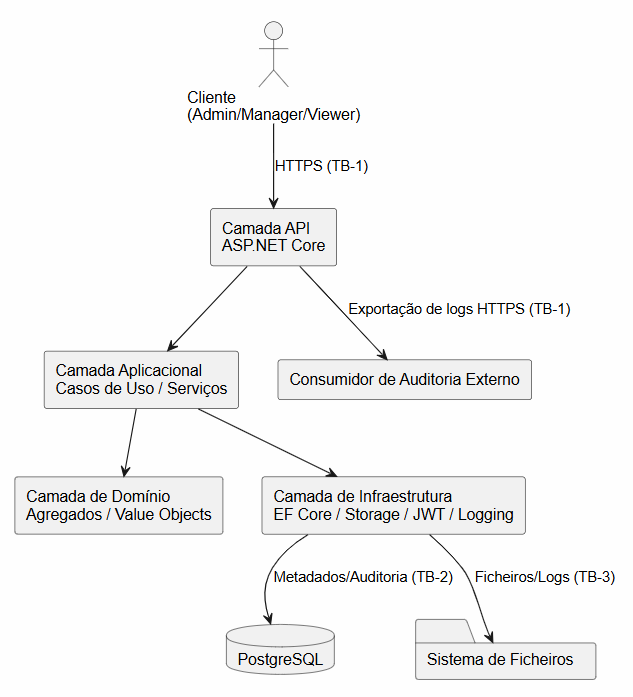
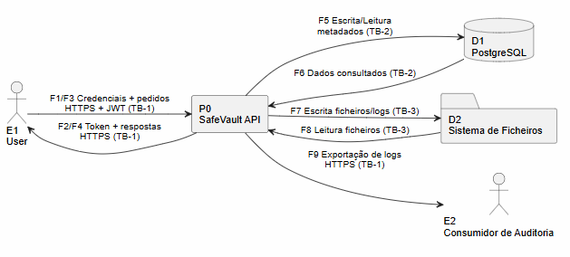
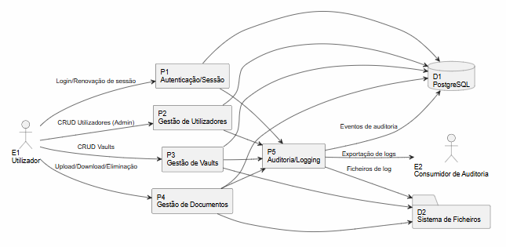
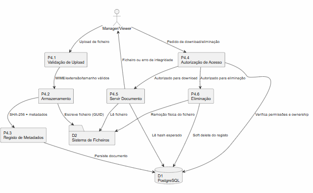

# SafeVault - Cofre Digital de Documentos
## DESOFS 2025/2026 - Phase 1 Deliverable

**Repositorio:** desofs2026_thu_ffs_3

**Turma:** thu_ffs

| Nome | Numero |
|------|--------|
| Joao Loureiro | 1250526 |
| Goncalo Barbosa | 1240454 |
| Miguel Amorim | 1250540 |
| Diogo Maria | 1201832 |

**Data de Entrega:** 20 de Abril de 2026

---

## Indice

1. [Visao Geral do Sistema](#1-visao-geral-do-sistema)
2. [Requisitos](#2-requisitos)
3. [Arquitectura e Modelo de Dominio](#3-arquitectura-e-modelo-de-dominio)
4. [Data Flow Diagrams](#4-data-flow-diagrams)
5. [Threat Modeling - STRIDE](#5-threat-modeling---stride)
6. [Risk Assessment](#6-risk-assessment)
7. [Mitigacoes](#7-mitigacoes)
8. [Security Testing Plan](#8-security-testing-plan)
9. [Referências](#9-referencias)

---

## 1. Visao Geral do Sistema

O **SafeVault** e uma API REST desenvolvida em ASP.NET Core com Entity Framework Core e base de dados PostgreSQL, destinada a gestao segura de documentos sensiveis em contexto organizacional. O sistema permite armazenar, organizar, partilhar e auditar documentos como contratos, ficheiros de RH e relatorios financeiros.

O sistema foi concebido tendo como premissa central o principio da seguranca por desenho. Todas as decisoes arquitecturais descritas neste documento foram tomadas com o objectivo de minimizar a superficie de ataque, garantir a confidencialidade dos dados e assegurar a rastreabilidade de todas as operacoes realizadas.

### Actores do Sistema

O sistema suporta tres papeis distintos, com permissoes claramente delimitadas:

| Actor | Descricao |
|----|-------|
| Admin | Gere utilizadores, configura o sistema e tem acesso total, incluindo a visualizacao de todos os logs de auditoria. |
| Manager | Cria e gere Vaults, faz upload de documentos e gere acessos dentro dos seus proprios Vaults. |
| Viewer | Pode apenas visualizar e descarregar documentos que lhe foram explicitamente partilhados. |
| Sistema de Auditoria Externo | Entidade externa que pode consumir logs de auditoria exportados em modo de leitura. |

### Funcionalidades Principais

O sistema disponibiliza as seguintes capacidades funcionais: autenticacao com JWT e suporte a refresh tokens; autorizacao baseada em papeis (RBAC) com verificacao server-side; criacao e gestao de Vaults com politicas de acesso configuradas; upload, download, versionamento e eliminacao de documentos; execucao de operacoes no sistema operativo do servidor, nomeadamente criacao de directorios e leitura, escrita e remocao de ficheiros; verificacao de integridade por hash SHA-256; registo de auditoria completo de todas as operacoes; e geracao automatica de ficheiros de log diarios no servidor.

---

## 2. Requisitos

### 2.1 Requisitos Funcionais

#### RF-01 - Autenticacao

O sistema deve permitir que os utilizadores se autentiquem com email e password, emitindo um JWT apos autenticacao bem-sucedida. O sistema suporta refresh tokens para renovacao de sessao. As passwords sao armazenadas com hash e salt usando bcrypt.

#### RF-02 - Gestao de Utilizadores

O Admin pode criar, editar, desactivar e eliminar utilizadores, atribuir e revogar papeis, visualizar todos os logs de auditoria do sistema e exportar relatorios de actividade.

#### RF-03 - Gestao de Vaults

O Manager pode criar um Vault com nome, descricao e politica de acesso. No momento da criacao, o sistema cria automaticamente um directorio no filesystem do servidor. O Manager pode convidar Viewers, definir regras de retencao de documentos e arquivar ou eliminar Vaults.

#### RF-04 - Gestao de Documentos

O Manager pode fazer upload de ficheiros para um Vault, com validacao de tipo e tamanho. O sistema grava o ficheiro no filesystem, calcula e armazena o hash SHA-256 e regista os metadados na base de dados. O download esta disponivel para Manager e Viewer com permissao, sendo sempre verificada a integridade do ficheiro antes da transferencia. O sistema suporta versionamento de documentos com manutencao de historico, e o Manager pode eliminar documentos com soft delete e remocao fisica do ficheiro.

#### RF-05 - Auditoria

O sistema regista na base de dados todos os eventos relevantes: login, upload, download, eliminacao e alteracao de permissoes. Sao gerados ficheiros de log diarios no servidor com rotacao automatica. O Admin pode consultar e filtrar o audit log.

#### RF-06 - Integridade de Ficheiros

O sistema verifica o hash SHA-256 de todos os ficheiros em operacoes de leitura, alertando e registando em auditoria qualquer divergencia de hash detectada.

### 2.2 Requisitos Nao-Funcionais

| Requisito | Descricao |
|------|-------|
| RNF-01 Seguranca | Comunicacoes sobre HTTPS/TLS 1.2 ou superior; JWT com expiracao maxima de 1 hora; refresh tokens com 7 dias; passwords com minimo de 12 caracteres incluindo maiusculas, minusculas, digitos e caracteres especiais; rate limiting de 10 tentativas por minuto por IP na autenticacao; proteccao CSRF em todos os endpoints com efeitos laterais. |
| RNF-02 Performance | Respostas em menos de 500ms para operacoes CRUD standard; suporte a uploads ate 100MB; disponibilidade de 99.5% em producao. |
| RNF-03 Manutenibilidade | Codigo seguindo principios SOLID e Clean Architecture; cobertura minima de testes de 70%; infraestrutura configuravel por variaveis de ambiente. |
| RNF-04 Auditabilidade | Todos os eventos de seguranca registados com timestamp UTC, utilizador, IP, operacao e resultado; logs imutaveis para utilizadores nao-Admin. |
| RNF-05 Conformidade | Conformidade com OWASP Top 10 2021 e ASVS v4.0 nivel 2. |

### 2.3 Requisitos de Seguranca

Os requisitos de seguranca foram derivados de tres fontes: boas praticas de seguranca (OWASP, ASVS), ameacas identificadas no threat modeling (Seccao 5), e requisitos regulatorios implicitos no contexto de documentos organizacionais sensiveis.

#### RS-01 - Autenticacao e Controlo de Acesso

- **RS-01.1** O sistema deve implementar autenticacao baseada em JWT com assinatura HS256 e chave minima de 256 bits.
- **RS-01.2** Os tokens JWT devem conter apenas os claims necessarios, sem dados sensiveis no payload.
- **RS-01.3** O sistema deve implementar RBAC com verificacao server-side em todos os endpoints.
- **RS-01.4** O sistema deve bloquear contas apos 5 tentativas de login falhadas consecutivas, com lockout de 15 minutos.
- **RS-01.5** As passwords devem ser hashadas com bcrypt com cost factor minimo de 12.
- **RS-01.6** Os refresh tokens devem ser rotativos, com revogacao automatica apos uso.

#### RS-02 - Seguranca dos Dados

- **RS-02.1** Dados sensiveis em base de dados devem ser protegidos em repouso.
- **RS-02.2** Credenciais e strings de ligacao nao devem estar versionadas no repositorio; devem usar variaveis de ambiente ou secrets manager.
- **RS-02.3** O sistema deve calcular e verificar o hash SHA-256 de todos os ficheiros em upload e download.
- **RS-02.4** As respostas de erro nao devem expor stack traces, paths internos ou dados de configuracao.

#### RS-03 - Comunicacao Segura

- **RS-03.1** Toda a comunicacao deve usar TLS 1.2 ou superior.
- **RS-03.2** Os headers HTTP de seguranca devem estar configurados: Strict-Transport-Security, X-Content-Type-Options, X-Frame-Options e Content-Security-Policy.
- **RS-03.3** O sistema nao deve aceitar ligacoes HTTP nao-seguras.

#### RS-04 - Validacao de Input e Tratamento de Dados

- **RS-04.1** Todos os inputs devem ser validados server-side quanto a tipo, tamanho, formato e charset.
- **RS-04.2** O sistema deve usar queries parametrizadas via Entity Framework Core para prevenir SQL Injection.
- **RS-04.3** Os nomes de ficheiros fornecidos pelos utilizadores devem ser sanitizados antes de qualquer uso no filesystem.
- **RS-04.4** O sistema deve validar o tipo MIME real do ficheiro por analise de conteudo, nao apenas pela extensao declarada.
- **RS-04.5** Os caminhos de ficheiros devem ser canonicalizados e verificados contra o directorio base autorizado para prevenir path traversal.

#### RS-05 - Componentes de Terceiros

- **RS-05.1** Todas as dependencias devem ser mantidas actualizadas com analise automatizada de vulnerabilidades (SCA) no pipeline CI/CD.
- **RS-05.2** Apenas pacotes sem vulnerabilidades conhecidas (CVE) e com licencas compativeis devem ser utilizados.

#### RS-06 - Logging e Monitorizacao

- **RS-06.1** O sistema deve registar todos os eventos de seguranca: autenticacoes, acessos a documentos, alteracoes de permissoes e erros de integridade.
- **RS-06.2** Os logs nao devem conter dados sensiveis como passwords, tokens ou conteudo de documentos.
- **RS-06.3** Os logs devem ser imutaveis para utilizadores nao-privilegiados.
- **RS-06.4** O sistema deve detectar e alertar para padroes anomalos, como multiplos downloads em curto espaco de tempo.

### 2.4 Abuse Cases

Os abuse cases descrevem como um actor malicioso pode tentar abusar do sistema para contornar os seus objectivos de seguranca. Cada caso identifica o actor, o objectivo, o vector de ataque, o impacto potencial e as mitigacoes correspondentes.

#### AC-01 - Brute Force de Credenciais

Um atacante externo utiliza ferramentas automatizadas para testar multiplas combinacoes de password numa conta conhecida, explorando a ausencia de rate limiting ou de politica de bloqueio de conta. O impacto potencial e o comprometimento total da conta e o acesso a documentos sensiveis. Este caso e mitigado pelos requisitos RS-01.4 (lockout de conta), RNF-01 (rate limiting) e RS-06.1 (registo de falhas de autenticacao).

#### AC-02 - Escalacao de Privilegios Horizontal (IDOR)

Um Viewer autenticado manipula identificadores de documentos ou Vaults nos pedidos HTTP para tentar aceder a recursos de outros utilizadores, explorando a ausencia de verificacao de autorizacao baseada no utilizador autenticado. O impacto e o acesso nao autorizado a documentos confidenciais. Este caso e mitigado pelo requisito RS-01.3 (RBAC server-side com verificacao de ownership).

#### AC-03 - Path Traversal no Upload de Ficheiros

Um Manager malicioso ou comprometido submete um ficheiro com nome contendo sequencias de travessia de directorio (ex: `../../../../etc/cron.d/backdoor`), explorando a ausencia de sanitizacao do nome do ficheiro. O impacto potencial e a escrita de ficheiros em localizacoes arbitrarias do servidor e a possibilidade de persistencia de acesso nao autorizado. Este caso e mitigado pelos requisitos RS-04.3 e RS-04.5.

#### AC-04 - Upload de Ficheiro Malicioso

Um Manager submete um ficheiro executavel renomeado com extensao aparentemente inofensiva (ex: webshell.aspx renomeado para relatorio.pdf), explorando a ausencia de validacao do tipo real do ficheiro. O impacto potencial e Remote Code Execution no servidor. Este caso e mitigado pelo requisito RS-04.4 (validacao por magic bytes) e pelo facto de os ficheiros nunca serem servidos directamente pelo servidor web.

#### AC-05 - Exfiltracao em Massa de Documentos

Um Viewer com acesso legitimo utiliza um script automatizado para iterar todos os documentos disponiveis e descarrega-los em bulk, explorando a ausencia de rate limiting nos endpoints de download e de monitorizacao comportamental. O impacto e a fuga massiva de informacao confidencial. Este caso e mitigado pelo requisito RS-06.4 (deteccao de anomalias) e pelo registo de todos os downloads em auditoria.

#### AC-06 - Manipulacao de Token JWT

Um utilizador autenticado tenta elevar o seu papel modificando o claim `role` no payload do JWT, ou explora a ausencia de rejeicao explicita do algoritmo `none`. O impacto e a escalacao de privilegios com acesso total ao sistema. Este caso e mitigado pelo requisito RS-01.1 (validacao rigorosa de assinatura JWT e rejeicao do algoritmo `none`).

#### AC-07 - SQL Injection via Parametros de Pesquisa

Um utilizador autenticado insere payloads de SQL Injection nos campos de pesquisa, explorando a construcao de queries por concatenacao de strings. O impacto potencial e a exfiltracao de todos os dados da base de dados ou a sua destruicao. Este caso e mitigado pelo requisito RS-04.2 (Entity Framework Core com queries parametrizadas).

---

## 3. Arquitectura e Modelo de Dominio

### 3.1 Visao da Arquitectura

O SafeVault segue uma arquitectura em camadas inspirada em Clean Architecture e Domain-Driven Design (DDD). A separacao em camadas garante que as regras de negocio e de seguranca nao dependem de detalhes de infraestrutura, facilitando a testabilidade e a substituicao de componentes sem afectar o nucleo do sistema.

A figura seguinte ilustra a arquitectura de camadas do sistema, bem como as trust boundaries entre os diferentes componentes e entidades externas.

As trust boundaries identificadas sao:

- **TB-1:** Entre o cliente externo e a API, atraves da internet ou intranet, com comunicacao exclusivamente por HTTPS.
- **TB-2:** Entre a camada de infraestrutura da API e a base de dados PostgreSQL, dentro do perimetro do servidor.
- **TB-3:** Entre a camada de infraestrutura da API e o filesystem do servidor, onde sao armazenados os ficheiros fisicos dos documentos e os logs diarios.

A figura seguinte detalha os componentes de seguranca activos em cada camada, incluindo o pipeline de autenticacao JWT/RBAC, os middlewares de seguranca, o servico de hash SHA-256 e o registo de auditoria.

### 3.2 Modelo de Dominio DDD

O modelo de dominio e composto por quatro agregados principais, cada um com as suas invariantes de dominio aplicadas na camada de dominio, independentemente da camada de apresentacao ou de persistencia.

**Agregado User** encapsula a identidade, credenciais e papel do utilizador. As suas invariantes sao: o email deve ser unico no sistema; um utilizador bloqueado nao pode autenticar-se; as passwords devem satisfazer os requisitos minimos de complexidade definidos no Value Object `PasswordPolicy`; e o maximo de refresh tokens activos por utilizador e cinco.

**Agregado Vault** representa o espaco de trabalho com politicas de acesso e retencao de documentos. As suas invariantes sao: o nome do Vault e validado no Value Object `VaultName`, rejeitando caracteres que possam ser usados em path traversal; o `DirectoryPath` e sempre calculado internamente pelo sistema e nunca fornecido pelo utilizador; um Vault arquivado nao aceita novos documentos; e apenas o Owner ou um Admin pode gerir acessos.

**Agregado Document** representa o ficheiro com classificacao, controlo de versoes e registo de hash de integridade. As suas invariantes sao: o `StoredFileName` e sempre um GUID gerado pelo sistema, nunca o nome original do ficheiro; o `FilePath` e calculado internamente com base no `VaultId` e no `StoredFileName`; o hash SHA-256 e calculado e armazenado no momento do upload e verificado em cada download; e um documento eliminado nao pode ser descarregado.

**Agregado AuditLog** e de suporte e regista todos os eventos de seguranca do sistema com informacao sobre o actor, o recurso afectado, o IP de origem, o resultado da operacao e o timestamp UTC.

### 3.3 Stack Tecnologico

| Componente | Tecnologia |
|--------|-------|
| Framework | ASP.NET Core (.NET 8) |
| ORM | Entity Framework Core 8.x |
| Base de Dados | PostgreSQL 16.x |
| Autenticacao | JWT Bearer (Microsoft.AspNetCore.Authentication.JwtBearer) |
| Validacao | FluentValidation 11.x |
| Hashing de Passwords | BCrypt.Net-Next 4.x |
| Logging | Serilog (console + ficheiro) |
| Testes | xUnit + Moq + FluentAssertions |
| Contentor | Docker + Docker Compose |
| CI/CD | GitHub Actions |
| SAST | SonarCloud (previsto em Phase 2) |
| SCA | OWASP Dependency-Check (previsto em Phase 2) |
| DAST | OWASP ZAP (previsto em Phase 2) |

---

## 4. Data Flow Diagrams

### 4.1 DFD Nivel 0 - Diagrama de Contexto

O DFD de nivel 0 apresenta o sistema como uma unidade unica e mostra as suas interaccoes com as entidades externas. O objectivo e evidenciar quais os dados que entram e saem do sistema e atraves de que trust boundaries transitam.

A tabela seguinte descreve os fluxos de dados identificados no diagrama de contexto:

| # | De | Para | Dados | Trust Boundary |
|---|---|---|----|----------|
| F1 | E1 - Utilizador | P0 - SafeVault API | Credenciais de autenticacao (HTTPS) | TB-1 |
| F2 | P0 - SafeVault API | E1 - Utilizador | JWT de acesso e refresh token (HTTPS) | TB-1 |
| F3 | E1 - Utilizador | P0 - SafeVault API | Pedidos autenticados com JWT (HTTPS) | TB-1 |
| F4 | P0 - SafeVault API | E1 - Utilizador | Respostas da API e ficheiros (HTTPS) | TB-1 |
| F5 | P0 - SafeVault API | D1 - PostgreSQL | Escrita e leitura de metadados e utilizadores | TB-2 |
| F6 | D1 - PostgreSQL | P0 - SafeVault API | Dados consultados | TB-2 |
| F7 | P0 - SafeVault API | D2 - Filesystem | Escrita de ficheiros e logs diarios | TB-3 |
| F8 | D2 - Filesystem | P0 - SafeVault API | Leitura de ficheiros para download | TB-3 |
| F9 | P0 - SafeVault API | E2 - Consumidor de Auditoria | Exportacao de logs (HTTPS autenticado) | TB-1 |

### 4.2 DFD Nivel 1 - Processos Principais

O DFD de nivel 1 decompoe o sistema em cinco processos principais, mostrando como os fluxos de dados circulam entre eles, as entidades externas e os data stores.

Os cinco processos identificados sao:

- **P1 - Autenticacao e Gestao de Sessao:** responsavel pelo login, validacao de credenciais, emissao de JWT, renovacao por refresh token e logout.
- **P2 - Gestao de Utilizadores:** disponivel apenas ao Admin; permite CRUD de utilizadores e gestao de papeis.
- **P3 - Gestao de Vaults:** permite a criacao, actualizacao, arquivo e gestao de acessos de Vaults, incluindo a criacao automatica do directorio no filesystem.
- **P4 - Gestao de Documentos:** processo mais critico em termos de seguranca; cobre upload, download, versionamento e eliminacao de documentos.
- **P5 - Auditoria e Logging:** recebe eventos de todos os outros processos e persiste-os na base de dados e em ficheiros de log diarios rotativos.

### 4.3 DFD Nivel 2 - Gestao de Documentos

Dado que o processo P4 e o mais critico do ponto de vista da seguranca, e aqui detalhado ao nivel 2. O diagrama mostra os sub-processos internos de P4 e os fluxos de dados entre eles.

O fluxo de upload percorre os sub-processos P4.1 (validacao de MIME, extensao e tamanho), P4.2 (geracao de `StoredFileName` como GUID, calculo de SHA-256 e escrita no filesystem) e P4.3 (persistencia de metadados e hash na base de dados).

O fluxo de download inicia em P4.4 (verificacao de permissoes e ownership), passa por P4.5 (leitura do ficheiro, recalculo de SHA-256 e comparacao com o hash armazenado) e termina com a entrega do ficheiro ao utilizador ou com um erro 409 em caso de divergencia de integridade.

O fluxo de eliminacao passa igualmente por P4.4 e termina em P4.6, que executa o soft delete na base de dados e a remocao fisica do ficheiro no filesystem.

A figura seguinte apresenta uma perspectiva transversal do fluxo de dados sensiveis no sistema, evidenciando as fronteiras entre a entrada de dados, o processamento interno e a saida com exposicao minima de informacao.

---

## 5. Threat Modeling - STRIDE

### 5.1 Metodologia

A metodologia STRIDE foi aplicada sistematicamente a cada elemento dos DFDs apresentados na seccao anterior: processos, fluxos de dados, data stores e entidades externas. Para cada elemento foram consideradas as seis categorias de ameacas: Spoofing, Tampering, Repudiation, Information Disclosure, Denial of Service e Elevation of Privilege.

### 5.2 Ameacas ao Processo P1 - Autenticacao

| ID | Categoria | Ameaca | Vector de Ataque | Agente |
|----|------|-----|-------------|--------|
| T-01 | Spoofing | Impersonificacao de utilizador por roubo de JWT | Interceccao de token em canal nao cifrado ou por XSS | Atacante externo |
| T-02 | Tampering | Modificacao do payload JWT para elevar papel | JWT algorithm confusion (none) ou chave fraca | Utilizador malicioso |
| T-03 | Repudiation | Utilizador nega ter realizado accoes sem registo de auditoria | Ausencia de logging de eventos de autenticacao | Utilizador interno |
| T-04 | Information Disclosure | Enumeracao de utilizadores por resposta diferenciada | Analise de respostas de login (user not found vs wrong password) | Atacante externo |
| T-05 | Denial of Service | Brute force ou credential stuffing bloqueiam contas legitimas | Automatizacao de tentativas de login sem rate limiting | Atacante externo |
| T-06 | Elevation of Privilege | Brute force bem-sucedido em conta Admin | Ausencia de rate limiting e de politica de lockout | Atacante externo |

A figura seguinte ilustra o fluxo normal de autenticacao, que serve de referencia para a analise das ameacas T-01 a T-06.

### 5.3 Ameacas ao Processo P4 - Gestao de Documentos

| ID | Categoria | Ameaca | Vector de Ataque | Agente |
|----|-------|--------|-------------|--------|
| T-07 | Spoofing | Acesso a documentos de outro Vault por IDOR | Manipulacao de document_id nos pedidos HTTP | Manager malicioso |
| T-08 | Tampering | Upload de ficheiro malicioso (webshell, malware) | Ausencia de validacao do tipo real do ficheiro | Manager comprometido |
| T-09 | Tampering | Path traversal via nome de ficheiro | Sequencias ../../../ no campo filename | Manager malicioso |
| T-10 | Tampering | Substituicao de ficheiro no filesystem sem actualizar hash | Acesso directo ao filesystem por insider | Admin ou sysadmin malicioso |
| T-11 | Information Disclosure | Download nao autorizado de documentos confidenciais | IDOR ou ausencia de autorizacao granular | Viewer com acesso parcial |
| T-12 | Information Disclosure | Exposicao de path interno do ficheiro em respostas de erro | Stack trace em respostas de erro | Atacante externo |
| T-13 | Denial of Service | Upload de ficheiro grande consumindo espaco em disco | Ausencia de validacao de tamanho | Utilizador malicioso |
| T-14 | Elevation of Privilege | Viewer acede a endpoint de upload | Ausencia de verificacao de autorizacao server-side | Viewer malicioso |

### 5.4 Ameacas aos Data Stores

| ID | Categoria | Ameaca | Vector de Ataque | Agente | Data Store |
|----|-----|--------|-----------|--------|--------|
| T-15 | Tampering | SQL Injection em pesquisas | Input nao sanitizado em queries dinamicas | Utilizador autenticado | D1 - PostgreSQL |
| T-16 | Information Disclosure | Exposicao de connection string no repositorio | Credenciais hardcoded no codigo versionado | Insider ou acesso ao repositorio | D1 - PostgreSQL |
| T-17 | Tampering | Manipulacao de logs de auditoria por Admin comprometido | Acesso directo a base de dados com credenciais elevadas | Admin malicioso | D1 - AuditLog |
| T-18 | Information Disclosure | Leitura directa de ficheiros por processo nao autorizado | Permissoes de filesystem incorrectas | Processo no servidor | D2 - Filesystem |
| T-19 | Denial of Service | Esgotamento do espaco em disco | Upload massivo sem quotas por utilizador | Utilizador malicioso | D2 - Filesystem |

### 5.5 Ameacas aos Fluxos de Dados

| ID | Categoria | Ameaca | Vector de Ataque | Agente | Fluxo |
|----|-----|--------|----------|--------|-----|
| T-20 | Information Disclosure | Interceccao de dados em transito | Man-in-the-Middle sem TLS | Atacante na rede | F1, F3, F4 |
| T-21 | Tampering | Modificacao de ficheiro em transito | MITM com ausencia de verificacao de integridade end-to-end | Atacante na rede | F4 |
| T-22 | Repudiation | Negacao de operacao de download por utilizador | Ausencia de registo de operacoes de download | Utilizador interno | F4 |

### 5.6 Tabela Consolidada de Ameacas

| ID | Ameaca (resumo) | Categoria | Componente | Probabilidade | Impacto | Risco |
|----|--------|-----------|---------|---------|---------|-------|
| T-08 | Upload de ficheiro malicioso | Tampering | P4 | Media | Critico | Critico |
| T-16 | Exposicao de connection string | Info Disclosure | D1 | Media | Critico | Critico |
| T-02 | Manipulacao de JWT | Tampering | P1 | Baixa | Critico | Alto |
| T-01 | Roubo de JWT | Spoofing | P1 | Media | Alto | Alto |
| T-06 | Comprometimento de conta Admin | Elevation | P1 | Baixa | Critico | Alto |
| T-07 | IDOR em documentos ou Vaults | Spoofing | P4 | Media | Alto | Alto |
| T-09 | Path traversal no upload | Tampering | P4 | Baixa | Critico | Alto |
| T-11 | Download nao autorizado | Info Disclosure | P4 | Media | Alto | Alto |
| T-14 | Viewer acede a endpoints de Manager | Elevation | P4 | Media | Alto | Alto |
| T-15 | SQL Injection | Tampering | D1 | Baixa | Critico | Alto |
| T-19 | Esgotamento de disco | DoS | D2 | Media | Alto | Alto |
| T-03 | Repudio sem auditoria | Repudiation | P1, P4 | Alta | Medio | Alto |
| T-22 | Repudio de downloads | Repudiation | F4 | Alta | Medio | Alto |
| T-05 | DoS por brute force | DoS | P1 | Media | Medio | Medio |
| T-10 | Substituicao de ficheiro no filesystem | Tampering | D2 | Baixa | Alto | Medio |
| T-12 | Exposicao de paths em erros | Info Disclosure | P4 | Alta | Baixo | Medio |
| T-13 | DoS por upload de ficheiro grande | DoS | P4 | Media | Medio | Medio |
| T-17 | Manipulacao de logs por Admin | Tampering | D1 | Baixa | Medio | Medio |
| T-18 | Acesso directo ao filesystem | Info Disclosure | D2 | Baixa | Alto | Medio |
| T-20 | Interceccao MITM | Info Disclosure | F1,F3,F4 | Baixa | Critico | Medio |
| T-04 | Enumeracao de utilizadores | Info Disclosure | P1 | Alta | Baixo | Medio |
| T-21 | Modificacao de ficheiro em transito | Tampering | F4 | Baixa | Alto | Medio |

---

## 6. Risk Assessment

### 6.1 Metodologia

O calculo de risco segue a OWASP Risk Rating Methodology, com a formula **Risco = Probabilidade x Impacto**.

**Escala de Probabilidade:**

| Valor | Significado |
|-------|-------------|
| 1 - Baixa | Requer capacidade tecnica elevada, acesso especial ou condicoes raras |
| 2 - Media | Exploracao viavel com ferramentas publicas, sem acesso especial |
| 3 - Alta | Exploracao trivial ou automatica em condicoes comuns |

**Escala de Impacto:**

| Valor | Significado |
|-------|-------------|
| 1 - Baixo | Impacto minimo; sem fuga de dados sensiveis |
| 2 - Medio | Impacto moderado; fuga de dados nao-criticos ou indisponibilidade parcial |
| 3 - Alto | Fuga de dados sensiveis ou comprometimento de utilizadores |
| 4 - Critico | Comprometimento total do sistema; fuga massiva de dados; RCE |

**Classificacao do Risco Final:**

| Score | Classificacao |
|-------|---------------|
| 1 a 2 | Baixo |
| 3 a 4 | Medio |
| 6 | Alto |
| 8 a 12 | Critico |

### 6.2 Tabela de Risco Quantificada

| ID | Ameaca | Probabilidade | Impacto | Score | Classificacao | Prioridade |
|----|---|------|---------|-------|------|------------|
| T-08 | Upload de ficheiro malicioso | 2 | 4 | 8 | Critico | P1 |
| T-16 | Exposicao de connection string | 2 | 4 | 8 | Critico | P1 |
| T-02 | Manipulacao de JWT | 1 | 4 | 4 | Alto | P1 |
| T-09 | Path traversal no upload | 1 | 4 | 4 | Alto | P2 |
| T-15 | SQL Injection | 1 | 4 | 4 | Alto | P2 |
| T-01 | Roubo de JWT | 2 | 3 | 6 | Alto | P2 |
| T-06 | Comprometimento de conta Admin | 1 | 4 | 4 | Alto | P2 |
| T-07 | IDOR em documentos ou Vaults | 2 | 3 | 6 | Alto | P2 |
| T-11 | Download nao autorizado | 2 | 3 | 6 | Alto | P2 |
| T-14 | Viewer acede a endpoints de Manager | 2 | 3 | 6 | Alto | P2 |
| T-19 | Esgotamento de disco | 2 | 3 | 6 | Alto | P2 |
| T-03 | Repudio sem auditoria | 3 | 2 | 6 | Alto | P2 |
| T-22 | Repudio de downloads | 3 | 2 | 6 | Alto | P2 |
| T-05 | DoS por brute force | 2 | 2 | 4 | Medio | P3 |
| T-10 | Substituicao de ficheiro no filesystem | 1 | 3 | 3 | Medio | P3 |
| T-12 | Exposicao de paths em erros | 3 | 1 | 3 | Medio | P3 |
| T-13 | DoS por upload de ficheiro grande | 2 | 2 | 4 | Medio | P3 |
| T-17 | Manipulacao de logs por Admin | 1 | 2 | 2 | Medio | P3 |
| T-18 | Acesso directo ao filesystem | 1 | 3 | 3 | Medio | P3 |
| T-20 | Interceccao MITM | 1 | 4 | 4 | Medio (com TLS) | P3 |
| T-04 | Enumeracao de utilizadores | 3 | 1 | 3 | Medio | P3 |
| T-21 | Modificacao de ficheiro em transito | 1 | 3 | 3 | Medio | P3 |

---

## 7. Mitigacoes

As mitigacoes estao organizadas por prioridade, correspondendo directamente aos niveis de risco identificados na seccao anterior. Cada mitigacao indica as ameacas que endereça e os requisitos de seguranca que a suportam.

### 7.1 Prioridade 1 - Risco Critico

**M-01 - Validacao rigorosa de ficheiros no upload** (endereça T-08, T-09)

A validacao de ficheiros no upload opera em tres camadas independentes. Primeiro, a extensao do ficheiro e verificada contra uma whitelist restrita de extensoes permitidas. Segundo, os primeiros bytes do stream do ficheiro (magic bytes) sao inspeccionados e comparados com os valores esperados para o tipo declarado, garantindo que um ficheiro executavel renomeado com extensao PDF e rejeitado. Terceiro, o nome original do ficheiro e sanitizado, removendo quaisquer caracteres que possam ser usados em path traversal, e um `StoredFileName` gerado internamente como GUID e usado exclusivamente no filesystem, nunca o nome original. O caminho final do ficheiro e sempre canonicalizado e verificado contra o directorio base autorizado antes de qualquer operacao de escrita. O tamanho maximo de 100MB e validado antes de processar o stream.

**M-02 - Gestao segura de segredos** (endereça T-16)

As credenciais, strings de ligacao e chaves criptograficas nao devem estar presentes no codigo-fonte nem em ficheiros de configuracao versionados. Em ambiente de desenvolvimento, o mecanismo `dotnet user-secrets` deve ser utilizado. Em ambiente de producao, o aprovisionamento deve ser feito por variaveis de ambiente ou por um secrets manager dedicado. Os ficheiros `appsettings.*.json` e `.env` devem constar do `.gitignore`.

**M-03 - JWT com validacao rigorosa** (endereça T-02)

O sistema usa HS256 com chave de pelo menos 256 bits gerada aleatoriamente e armazenada como variavel de ambiente. O algoritmo `none` e explicitamente rejeitado na configuracao do JWT Bearer. Em cada pedido, o sistema valida obrigatoriamente a assinatura criptografica, a expiracao (`exp`), o emissor (`iss`) e a audiencia (`aud`). O payload do JWT contem apenas os claims minimos necessarios - `sub`, `role`, `jti`, `exp`, `iss` - sem qualquer dado sensivel. A utilizacao do claim `jti` unico por token permite a revogacao individual quando necessario.

### 7.2 Prioridade 2 - Risco Alto

**M-04 - Autorizacao granular server-side e prevencao de IDOR** (endereça T-07, T-11, T-14)

Toda a logica de autorizacao e verificada na camada Application, independentemente dos Controllers. Em cada operacao sobre um documento ou Vault, o sistema verifica se o utilizador autenticado tem permissao explicita sobre aquele recurso especifico. Os identificadores de recursos publicos sao GUIDs, dificultando a enumeracao. O `sub` do JWT e sempre a fonte de verdade para o utilizador autenticado, nunca dados enviados pelo cliente. Nas operacoes de listagem, os resultados sao sempre filtrados pelo utilizador autenticado antes de serem devolvidos.

**M-05 - Rate limiting e politica de lockout** (endereça T-05, T-06)

Os endpoints de autenticacao estao sujeitos a rate limiting de 10 pedidos por minuto por IP de origem. Apos cinco tentativas de login falhadas consecutivas, a conta e bloqueada durante 15 minutos. O evento de bloqueio e registado em auditoria com IP de origem e timestamp. As mensagens de erro durante o lockout sao genericas e nao revelam se a conta existe ou se a password esta incorrecta.

**M-06 - Verificacao de integridade SHA-256** (endereça T-10, T-21)

No momento do upload, o hash SHA-256 e calculado sobre o stream do ficheiro antes da escrita no disco e armazenado na base de dados conjuntamente com os metadados do documento. No momento do download, o hash e recalculado sobre o ficheiro em disco e comparado com o valor armazenado. Uma divergencia resulta na rejeicao do pedido com HTTP 409 Conflict e no registo do evento no audit log, incluindo utilizador, IP, timestamp e `document_id`. O calculo e realizado em modo streaming para evitar o carregamento integral de ficheiros grandes em memoria.

A figura seguinte ilustra a sequencia de download com os dois caminhos possiveis: hash valido e hash invalido.

**M-07 - Audit logging completo** (endereça T-03, T-22)

O sistema regista na base de dados todos os eventos de seguranca relevantes: autenticacoes com sucesso e com falha, uploads, downloads, eliminacoes, alteracoes de permissoes e erros de integridade. Cada entrada contem: timestamp UTC, `utilizadorId`, endereco IP de origem, operacao realizada, identificador do recurso afectado, resultado (sucesso ou falha) e detalhes adicionais. Os logs nao contem dados sensiveis como passwords, tokens ou conteudo de documentos. Apenas o processo da aplicacao tem permissao de escrita nos logs.

**M-08 - Prevencao de SQL Injection via Entity Framework Core** (endereça T-15)

O uso de Entity Framework Core com LINQ queries parametrizadas previne SQL Injection por defeito. A regra e nunca usar `FromSqlRaw()` com concatenacao de strings. Qualquer uso de `FromSqlInterpolated()` ou LINQ standard esta coberto por parametrizacao automatica. Os inputs de pesquisa sao validados e sanitizados antes de serem passados ao ORM.

**M-09 - Quotas de disco e rate limiting de uploads** (endereça T-19)

O tamanho maximo de cada ficheiro e validado antes de processar o stream, com rejeicao imediata acima de 100MB. Cada Vault tem uma quota de armazenamento configuravel. O uso de disco e monitorizado e alertado quando acima de 80% da capacidade.

### 7.3 Prioridade 3 - Risco Medio

**M-10 - Headers de seguranca HTTP** (endereça T-20, T-12)

O `SecurityHeadersMiddleware` configura os seguintes headers em todas as respostas: `Strict-Transport-Security` com `max-age` de 31536000 segundos e `includeSubDomains`, que forca HTTPS durante um ano; `X-Content-Type-Options: nosniff`, que impede a interpretacao de ficheiros com MIME incorrecto; `X-Frame-Options: DENY`, que bloqueia embedding em iframes; `Content-Security-Policy: default-src 'none'`, com bloqueio total adequado a uma API pura; e `Referrer-Policy: no-referrer`. O header `Server` e removido das respostas para nao expor a versao do servidor web.

**M-11 - Tratamento seguro de erros** (endereça T-12)

O `ExceptionHandlingMiddleware` intercepta todas as excepcoes nao tratadas antes de chegarem ao cliente. As respostas de erro devolvem apenas o codigo HTTP, uma mensagem generica e um identificador de correlacao (`traceId`). Nunca sao incluidos stack traces, mensagens de excepcao internas, strings de ligacao, caminhos de ficheiros internos ou nomes de tabelas. O detalhe completo da excepcao e registado internamente nos logs do servidor, referenciado pelo `traceId` para facilitar o diagnostico sem expor informacao ao exterior.

**M-12 - Permissoes de filesystem restritivas** (endereça T-18)

O processo do servidor deve correr com um utilizador de sistema sem privilegios. O directorio de storage deve ter permissoes 700, acessivel apenas pelo processo da aplicacao. Em ambiente Docker, o container deve correr como utilizador nao-root.

---

## 8. Security Testing Plan

### 8.1 Metodologia

O plano de testes de seguranca segue uma abordagem em pirâmide que combina quatro niveis complementares. Os testes unitarios de seguranca verificam as regras de dominio, a sanitizacao de inputs e as funcoes de hashing ao nivel de componente isolado. Os testes de integracao validam os fluxos de autenticacao e autorizacao, a verificacao de integridade e o comportamento dos middlewares de seguranca com a aplicacao em execucao. A analise estatica (SAST) inspecciona o codigo-fonte em busca de vulnerabilidades sem executar o sistema. A analise de composicao de software (SCA) verifica as dependencias externas contra bases de dados de vulnerabilidades conhecidas. Os testes dinamicos (DAST) serao introduzidos na Phase 2 com OWASP ZAP.

### 8.2 Testes por Abuse Case

| Abuse Case | Tipo de Teste | Criterio de Sucesso |
|-----|--------|-------------|
| AC-01 Brute force | Integracao | Lockout apos 5 tentativas; rate limiting com resposta 429 |
| AC-02 IDOR | Integracao | GET /documents/{id_alheio} retorna 403 Forbidden |
| AC-03 Path traversal | Unitario e Integracao | Upload com filename contendo ../ resulta em ValidationException ou 400 |
| AC-04 Web shell upload | Unitario | Upload de ficheiro com magic bytes invalidos retorna 400 Bad Request |
| AC-05 Exfiltracao em massa | Integracao | Rate limiting de downloads funcional; eventos registados em auditoria |
| AC-06 JWT tampering | Integracao | Token com role=Admin modificado retorna 401; algoritmo none retorna 401 |
| AC-07 SQL Injection | SAST e Integracao | Nenhuma query vulneravel; OWASP ZAP sem alertas criticos |

### 8.3 Casos de Teste de Seguranca

#### ST-01 - Autenticacao e JWT

- ST-01.1: Login com credenciais validas retorna 200 OK com JWT e refresh token.
- ST-01.2: Login com password incorrecta retorna 401 com mensagem generica, sem indicar qual campo falhou.
- ST-01.3: Cinco falhas de login consecutivas resultam em bloqueio; a sexta tentativa retorna 401 ou 429.
- ST-01.4: JWT com assinatura adulterada retorna 401 Unauthorized.
- ST-01.5: JWT com algoritmo `none` e rejeitado com 401 Unauthorized.
- ST-01.6: JWT expirado retorna 401 Unauthorized.
- ST-01.7: JWT com claim `role` modificado para Admin retorna 403 Forbidden.
- ST-01.8: Refresh token reutilizado apos rotacao retorna 401 Unauthorized.

#### ST-02 - Autorizacao RBAC

- ST-02.1: Viewer tenta fazer upload para um Vault e recebe 403 Forbidden.
- ST-02.2: Viewer tenta aceder a documento de outro Vault por IDOR e recebe 403 Forbidden.
- ST-02.3: Manager tenta aceder a endpoints de gestao de utilizadores e recebe 403 Forbidden.
- ST-02.4: Utilizador nao autenticado acede a qualquer endpoint protegido e recebe 401 Unauthorized.
- ST-02.5: Admin acede a todos os endpoints com sucesso.
- ST-02.6: Manager tenta eliminar Vault de outro Manager e recebe 403 Forbidden.

#### ST-03 - Validacao de Ficheiros

- ST-03.1: Upload de ficheiro com extensao permitida e magic bytes corretos retorna 200 OK.
- ST-03.2: Upload de ficheiro com extensao .exe retorna 400 Bad Request.
- ST-03.3: Upload de ficheiro PDF com magic bytes de EXE retorna 400 Bad Request.
- ST-03.4: Upload com filename contendo `../../../etc/passwd` retorna 400 Bad Request.
- ST-03.5: Upload de ficheiro superior a 100MB retorna 413 Payload Too Large.

#### ST-04 - Integridade de Ficheiros

- ST-04.1: Download de ficheiro integro retorna 200 OK com o ficheiro correcto.
- ST-04.2: Ficheiro corrompido no disco retorna 409 Conflict e o evento e registado em auditoria.
- ST-04.3: O hash armazenado na base de dados apos upload coincide com o hash calculado no momento do upload.
- ST-04.4: O evento de falha de integridade e registado com IP de origem, `utilizadorId` e timestamp.

### 8.4 Processo de Revisao do Threat Model

O threat model deve ser revisto sempre que for adicionada uma nova funcionalidade significativa, sempre que a arquitectura for alterada, no inicio de cada Sprint e aquando de vulnerabilidades reportadas nos componentes utilizados. A tabela de revisoes e mantida no documento [phase1-assessment-readiness.md](phase1-assessment-readiness.md).

---

## 9. Referencias

- OWASP Application Security Verification Standard v4.0.3
- OWASP Top 10 2021
- OWASP Risk Rating Methodology
- OWASP Threat Modeling Cheat Sheet
- Microsoft Threat Modeling Tool - STRIDE
- NIST SP 800-63B Digital Identity Guidelines
- ASP.NET Core Security Documentation
- Entity Framework Core Documentation
- JWT Best Practices - RFC 8725

---

## Anexos

- [Phase 1 - ASVS Checklist](phase1-asvs-checklist.md)
- [Phase 1 - Traceability Matrix](phase1-traceability-matrix.md)
- [Phase 1 - Assessment Readiness](phase1-assessment-readiness.md)