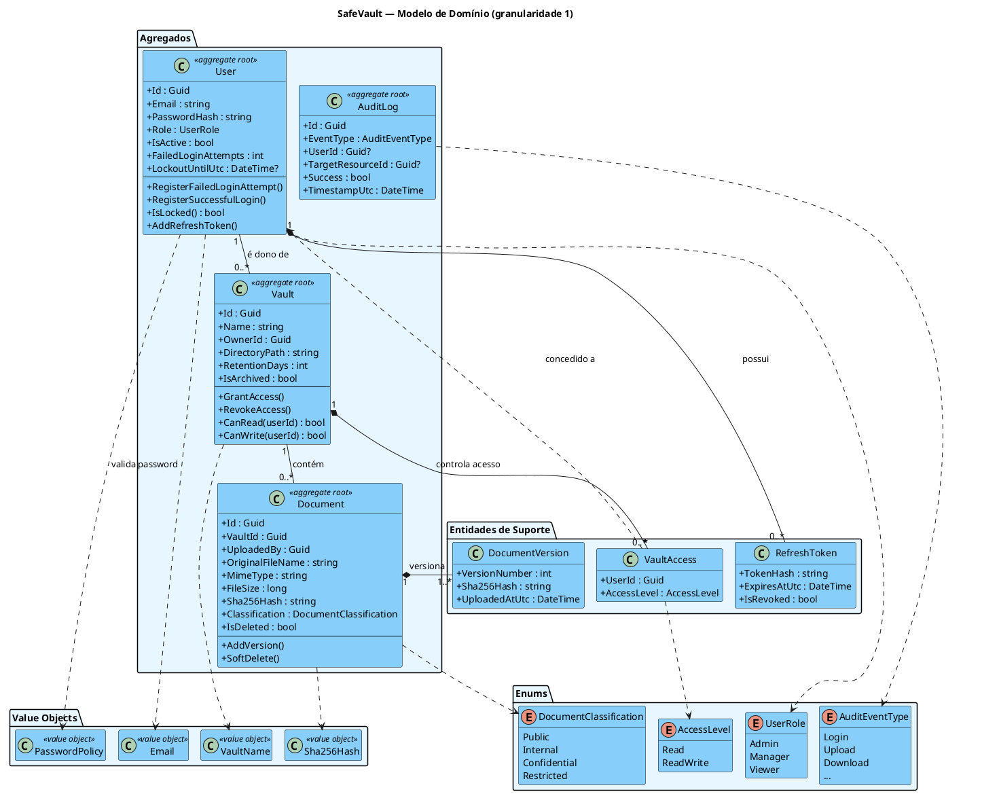
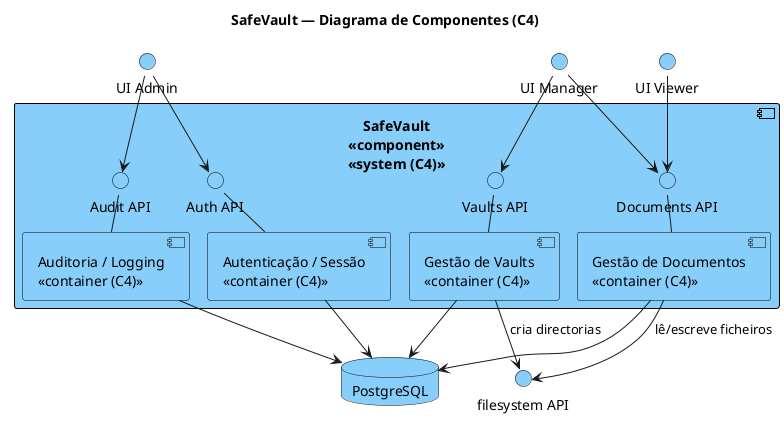
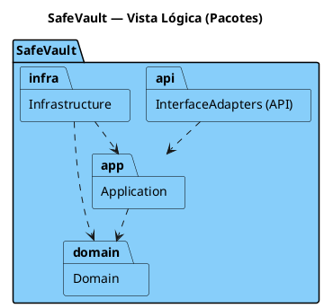
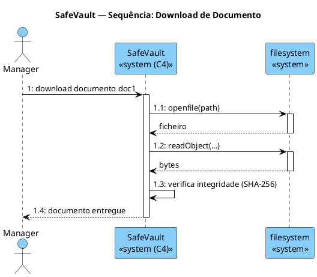

# SafeVault — Phase 2 · Sprint 2 — Deliverable

**Repositório:** desofs2026_thu_ffs_3
**Turma:** thu_ffs (Prof. FFS) — Equipa 3
**Sprint:** Phase 2 — Sprint 2 (final)
**Data de entrega:** 16 de Junho de 2026

| Nome | Número |
|------|--------|
| João Loureiro | 1250526 |
| Gonçalo Barbosa | 1240454 |
| Miguel Amorim | 1250540 |
| Diogo Maria | 1201832 |

> **Como ler este documento.** Está organizado pela rubrica oficial do Sprint 2
> (secção 6.3 do enunciado): Organização (5%), Desenvolvimento (35%), Build & Test
> (35%), Produção (5%), Operação (5%) e ASVS (15%). A
> [Secção 1](#1-resolução-das-notas-de-avaliação-checklist) mapeia diretamente as
> notas de avaliação recebidas para a respetiva resolução e evidência. Todas as
> evidências de execução (testes, DAST) foram **re-verificadas em 16/06/2026** e
> estão no [Apêndice A](#apêndice-a--evidência-de-execução-16062026).

---

## Índice

1. [Resolução das notas de avaliação (checklist)](#1-resolução-das-notas-de-avaliação-checklist)
2. [Organização e Linguagem (5%)](#2-organização-e-linguagem-5)
3. [Desenvolvimento (35%)](#3-desenvolvimento-35)
4. [Build e Testes (35%)](#4-build-e-testes-35)
5. [Produção (5%)](#5-produção-5)
6. [Operação (5%)](#6-operação-5)
7. [ASVS (15%)](#7-asvs-15)
8. [Rastreabilidade — Ameaças Phase 1 → Sprint 2](#8-rastreabilidade--ameaças-phase-1--sprint-2)
9. [Apêndice A — Evidência de execução (16/06/2026)](#apêndice-a--evidência-de-execução-16062026)

---

## 1. Resolução das notas de avaliação (checklist)

Cada item de feedback recebido é mapeado abaixo para a resolução concreta e a evidência no repositório.

| # | Nota de avaliação | Estado | Resolução e evidência |
|---|-------------------|--------|------------------------|
| 1 | Ver as ameaças, resolvê-las e mostrar **como** | Resolvido | Matriz de rastreabilidade com 22 ameaças STRIDE, mitigação por ameaça e teste associado — [Secção 8](#8-rastreabilidade--ameaças-phase-1--sprint-2) e [`phase2_sprint2_traceability_matrix.md`](phase2_sprint2_traceability_matrix.md) |
| 2 | Usar o **ZAP** para ver vulnerabilidades | Resolvido | DAST autenticado (ZAP API scan via OpenAPI). Resultado: **0 FAIL · 0 WARN · 119 PASS** — [Secção 4.3](#43-dast--owasp-zap) e [Apêndice A.2](#a2-dast--owasp-zap-api-scan-autenticado) |
| 3 | Ameaças da 1.ª entrega → ver se **desapareceram** + provar em código | Resolvido | Testes de regressão de segurança anotados por ID de ameaça; ameaça **T-16 deixou de existir** (eliminada por design) — [Secção 8](#8-rastreabilidade--ameaças-phase-1--sprint-2) |
| 4 | Melhorar **GitHub Actions** em stages diferentes | Resolvido | `ci.yml` com **5 stages** (Build → Test → SCA → Docker Build → DAST) — [Secção 4.1](#41-pipeline-ci-multi-estágio) |
| 5 | **Aprovação manual** obrigatória para merge em `main` | Resolvido | `CODEOWNERS` + branch protection (≥1 aprovação, Code Owners) + template de PR — [Secção 4.4](#44-controlo-de-pull-requests) |
| 6 | Atualizar **diagramas** (componentes, vista lógica 1/2, domínio granularidade 1) | Resolvido | 4 novos diagramas PlantUML + PNG — [Secção 3.3](#33-diagramas-de-arquitectura) |
| 7 | **Comprovar a segurança com testes** | Resolvido | **106 testes**, 0 falhas; testes de regressão de segurança dedicados — [Secção 4.2](#42-testes) e [Apêndice A.1](#a1-build-e-testes-unitários) |
| 8 | Mostrar **qual o algoritmo melhor** (hashing) | Resolvido | Justificação BCrypt (work factor 12) vs MD5/SHA/Argon2 — [Secção 3.2.1](#321-justificação-do-algoritmo-de-hashing-de-passwords) |
| 9 | **Releases** automáticas via Actions | Resolvido | `release.yml`: tag `v*.*.*` → testes → binários multi-plataforma → Docker → GitHub Release — [Secção 4.5](#45-pipeline-de-release-automático) |
| 10 | **Auto run no Docker** / Docker Hub / guardar nova versão | Resolvido | `docker-compose.yml` + push para GHCR **e** Docker Hub com versionamento semântico — [Secção 5](#5-produção-5) |
| 11 | **SQL injection** não passa | Resolvido | EF Core parametrizado + IAST runtime; ZAP regra `40018` (SQLi) = **PASS** — [Secção 3.2](#32-segurança--controlos-implementados) |
| 12 | Passwords **não em string** / protegidas | Resolvido | BCrypt (nunca em plaintext); testes provam hash + salt único — [Secção 3.2.1](#321-justificação-do-algoritmo-de-hashing-de-passwords) |
| 13 | **Análise de dependências** (SCA) | Resolvido | Stage 3 do pipeline (`dotnet list package --vulnerable`) — [Secção 4.1](#41-pipeline-ci-multi-estágio) |
| 14 | **Arranjar o ZAP** (estava estranho) | Resolvido | Substituído o *baseline scan* (inútil em API JSON) por **API scan autenticado** na rede correta, com token dinâmico — [Secção 4.3](#43-dast--owasp-zap) |

### 1.1 Bugs encontrados e corrigidos durante a verificação final

Ao executar o sistema de ponta a ponta para esta entrega (em vez de confiar apenas na documentação), foram detetados e **corrigidos** três defeitos reais. Isto demonstra que a verificação foi genuína:

| Defeito | Causa | Correção | Evidência |
|---------|-------|----------|-----------|
| API devolvia **500** em todos os endpoints com BD | As migrations EF Core **nunca eram aplicadas** no arranque → `relation "Users" does not exist` | `db.Database.Migrate()` no startup | [`Program.cs`](../../src/InterfaceAdapters/Program.cs) · [Apêndice A.3](#a3-correcção-do-arranque-migrations) |
| Projeto de testes **não compilava** | `ControllersCoverageTests` chamava `Upload()` com assinatura antiga | Teste atualizado para o `UploadDocumentForm` atual | [`ControllersCoverageTests.cs`](../../tests/InterfaceAdaptersTests/ControllersCoverageTests.cs) |
| Input inválido devolvia **500 + error disclosure** | `ArgumentException` (de `PasswordPolicy`/`Email`) não mapeada | Mapeada para **400 Bad Request** | [`ExceptionHandlingMiddleware.cs`](../../src/InterfaceAdapters/Middleware/ExceptionHandlingMiddleware.cs) |

A correção do mapeamento de erros eliminou os 3 alertas WARN que o ZAP reportava em `/api/auth/register`, levando o scan a **0 FAIL · 0 WARN**.

---

## 2. Organização e Linguagem (5%)

- Documento principal único (este ficheiro) com ligações para todos os artefactos (código, diagramas, relatórios, checklist ASVS).
- Estrutura de repositório por camadas (Clean Architecture) e entregáveis por fase/sprint em [`Deliverables/`](../).
- Documentação em Português, com referências de código clicáveis para cada afirmação.

---

## 3. Desenvolvimento (35%)

### 3.1 Funcionalidade — complexidade e boas práticas

Backend completo em **ASP.NET Core (.NET 9)** com **PostgreSQL**, seguindo **DDD + Clean Architecture**:

- **3 agregados + 1 de suporte:** `User`, `Vault`, `Document` (+ `AuditLog`), satisfazendo o requisito de ≥3 agregados.
- **3 papéis RBAC:** `Admin`, `Manager`, `Viewer`, com verificação server-side em todos os endpoints.
- **Operações de SO no backend:** criação de directorias ao criar vaults, escrita/leitura/remoção de ficheiros, logs de auditoria diários — [`FileStorageService.cs`](../../src/Infrastructure/Storage/FileStorageService.cs).
- **Encapsulamento de domínio:** entidades com setters privados, invariantes nos construtores/métodos, value objects (`Email`, `VaultName`, `Sha256Hash`, `PasswordPolicy`).
- **Logging:** Serilog (consola + ficheiro diário rotativo) e auditoria na BD via `AuditWriterService`.

### 3.2 Segurança — controlos implementados

| Controlo | Localização | Ameaça mitigada |
|----------|-------------|-----------------|
| BCrypt com work factor 12 | [`PasswordHasherService.cs`](../../src/Infrastructure/Security/PasswordHasherService.cs) | T-05, T-06 |
| JWT HS256, chave ≥ 32 chars, `RequireSignedTokens` | [`JwtTokenService.cs`](../../src/Infrastructure/Security/JwtTokenService.cs) / [`Program.cs`](../../src/InterfaceAdapters/Program.cs) | T-01, T-02 |
| RBAC server-side + ownership (`CanRead`/`CanWrite`) | [`Vault.cs`](../../src/Domain/EntityModels/Vault.cs) / Controllers | T-07, T-11, T-14 |
| Validação de magic bytes no upload | [`DocumentService.cs`](../../src/Application/Services/DocumentService.cs) | T-08 |
| Path traversal prevention (canonicalização) | [`FileStorageService.cs`](../../src/Infrastructure/Storage/FileStorageService.cs) | T-09 |
| SHA-256 no upload + verificação no download | [`DocumentService.cs`](../../src/Application/Services/DocumentService.cs) | T-10, T-21 |
| Rate limiting 10 req/min/IP no auth | [`Program.cs`](../../src/InterfaceAdapters/Program.cs) | T-05 |
| Lockout após 5 falhas (15 min) | [`User.cs`](../../src/Domain/EntityModels/User.cs) | T-05, T-06 |
| EF Core parametrizado (sem SQL dinâmico) | [`Repositories/`](../../src/Infrastructure/Repositories/) | T-15 (SQLi) |
| IAST middleware (deteção runtime) | [`IastMonitoringMiddleware.cs`](../../src/InterfaceAdapters/Middleware/IastMonitoringMiddleware.cs) | T-15 |
| Headers de segurança HTTP | [`SecurityHeadersMiddleware.cs`](../../src/InterfaceAdapters/Middleware/SecurityHeadersMiddleware.cs) | T-20 |
| Erros sem detalhe interno (400/correlation ID) | [`ExceptionHandlingMiddleware.cs`](../../src/InterfaceAdapters/Middleware/ExceptionHandlingMiddleware.cs) | T-12 |
| Secrets fora do repositório (env vars + validação no startup) | [`Program.cs`](../../src/InterfaceAdapters/Program.cs) / [`.env.example`](../../.env.example) | T-16 |

#### 3.2.1 Justificação do algoritmo de hashing de passwords

O sistema usa **BCrypt** com work factor 12 — [`PasswordHasherService.cs`](../../src/Infrastructure/Security/PasswordHasherService.cs).

| Algoritmo | Velocidade atacante (GPU) | Salt automático | Custo adaptativo | Adequado a passwords |
|-----------|---------------------------|-----------------|------------------|----------------------|
| MD5 | ~10 GB/s | Não | Não | **NÃO** |
| SHA-256 | ~5 GB/s | Não | Não | **NÃO** |
| SHA-256 + salt manual | ~4 GB/s | Manual | Não | **NÃO** |
| **BCrypt (cost=12)** | **~150 H/s** | **Sim** | **Sim** | **SIM** |
| Argon2id | ~50 H/s | Sim | Sim | SIM (alternativa) |

BCrypt é ~7 ordens de magnitude mais lento que MD5 para um atacante, tornando força-bruta offline inviável. As passwords **nunca são guardadas em plaintext**; os testes
[`PasswordHasher_DoesNotStore_PlaintextPassword`](../../tests/InfrastructureTests/SecurityInfrastructureTests.cs),
[`PasswordHasher_UsesWorkFactor12`](../../tests/InfrastructureTests/SecurityInfrastructureTests.cs) e
[`PasswordHasher_ProducesDifferentHashesForSameInput`](../../tests/InfrastructureTests/SecurityInfrastructureTests.cs) provam-no em código.

### 3.3 Diagramas de arquitectura

Diagramas criados/atualizados para este sprint. As fontes PlantUML (`.puml`) e as imagens (`.png`) estão em [`Deliverables/Diagrams/`](../Diagrams/).

#### Modelo de domínio (granularidade 1)

Visão geral dos 3 agregados (`User`, `Vault`, `Document`) + agregado de suporte `AuditLog`, entidades de suporte, value objects e enums.



*Fonte: [`phase2_sprint2-domain-model.puml`](../Diagrams/phase2_sprint2-domain-model.puml)*

#### Diagrama de componentes (C4)

Vista C4 do sistema SafeVault: contentores (Autenticação, Gestão de Vaults, Gestão de Documentos, Auditoria), as APIs que cada um provê, os atores por papel RBAC (UI Admin/Manager/Viewer) e os recursos externos (filesystem API, PostgreSQL).



*Fonte: [`phase2_sprint2-component.puml`](../Diagrams/phase2_sprint2-component.puml)*

#### Vista lógica (pacotes)

As quatro camadas (Clean Architecture) como pacotes e a regra de dependência: as setas apontam "para dentro" (o Domínio não conhece a Infraestrutura nem a API).



*Fonte: [`phase2_sprint2-logical-view.puml`](../Diagrams/phase2_sprint2-logical-view.puml)*

#### Diagrama de sequência — download de documento

Execução de funcionalidades do sistema operativo no backend (requisito obrigatório): leitura de ficheiro do filesystem (`openfile`/`readObject`) com verificação de integridade SHA-256 antes da entrega.



*Fonte: [`phase2_sprint2-sequence-download.puml`](../Diagrams/phase2_sprint2-sequence-download.puml)*

---

## 4. Build e Testes (35%)

### 4.1 Pipeline CI multi-estágio

Ficheiro: [`.github/workflows/ci.yml`](../../.github/workflows/ci.yml)

```
Stage 1: Build  →  Stage 2: Test & Coverage
                →  Stage 3: SCA              (paralelo)
                           ↓
                    Stage 4: Docker Build
                           ↓
                    Stage 5: DAST (ZAP)      (push para main)
```

| Estágio | O que faz | Artefacto |
|---------|-----------|-----------|
| 1 — Build | `dotnet build -c Release` | cache de compilação |
| 2 — Test & Coverage | `dotnet test` + Cobertura | `coverage-report/`, TRX |
| 3 — SCA | `dotnet list package --vulnerable --include-transitive` | `sca-report.txt` |
| 4 — Docker Build | valida o `Dockerfile` (build sem push) | — |
| 5 — DAST | ZAP API scan autenticado contra o stack | `zap-api-report` |

SAST adicional: [`codeql.yml`](../../.github/workflows/codeql.yml) (`security-extended`). Secret scanning: [`secret-scan.yml`](../../.github/workflows/secret-scan.yml) (Gitleaks).

### 4.2 Testes

**106 testes, 0 falhas** (verificado em 16/06/2026 — [Apêndice A.1](#a1-build-e-testes-unitários)):

| Projeto | Testes |
|---------|--------|
| `SafeVault.DomainTests` | 35 |
| `SafeVault.ApplicationTests` | 33 |
| `SafeVault.InfrastructureTests` | 22 |
| `SafeVault.InterfaceAdaptersTests` | 16 |
| **Total** | **106** |

Testes de regressão de segurança dedicados, anotados por ID de ameaça Phase 1:
[`SecurityThreatMitigationTests.cs`](../../tests/DomainTests/SecurityThreatMitigationTests.cs),
[`SecurityApplicationTests.cs`](../../tests/ApplicationTests/SecurityApplicationTests.cs),
[`SecurityInfrastructureTests.cs`](../../tests/InfrastructureTests/SecurityInfrastructureTests.cs).

### 4.3 DAST — OWASP ZAP

A SafeVault é uma **API REST JSON**: um *baseline scan* (só spider + passive) quase não encontra superfície de ataque. Por isso usa-se o **ZAP API scan** a partir da especificação OpenAPI (`.zap/swagger.json`), **autenticado** com um JWT obtido em runtime, executado na **mesma rede Docker** que a API.

- Pipeline: [`dast.yml`](../../.github/workflows/dast.yml) (Stage 5 do CI em push para `main`; também manual para alvo externo).
- Configuração e política de alertas: [`.zap/`](../../.zap/) (`rules.tsv` marca SQLi/XSS/Path Traversal/OS Command Injection como **FAIL**).
- Documentação do setup: [`.zap/README.md`](../../.zap/README.md).

**Resultado (16/06/2026):** `FAIL-NEW: 0 · WARN-NEW: 0 · PASS: 119`.

> **Nota sobre o falso positivo de SQL Injection.** Numa execução intermédia, o ZAP
> reportou SQLi em `/api/audit`. Investigação: o token de autenticação vinha `null`
> (porque o `register` estava a falhar — ver [1.1](#11-bugs-encontrados-e-corrigidos-durante-a-verificação-final)),
> pelo que todos os pedidos autenticados davam 401 e a regra disparava por
> diferença de respostas de erro. Após corrigir o arranque e usar um token válido, a
> regra `40018` (SQLi) passa a **PASS** — confirmando que o EF Core parametrizado
> segura. Evidência no [Apêndice A.2](#a2-dast--owasp-zap-api-scan-autenticado).

### 4.4 Controlo de Pull Requests

- [`.github/CODEOWNERS`](../../.github/CODEOWNERS) — exige revisão de membro da equipa em todos os ficheiros (e paths sensíveis: workflows, `Security/`, `Middleware/`).
- [`.github/pull_request_template.md`](../../.github/pull_request_template.md) — checklist de segurança obrigatório.
- **Branch protection** em `main` (GitHub → Settings → Branches): ≥ 1 aprovação, *Require review from Code Owners*, *Dismiss stale reviews*, checks de CI obrigatórios antes do merge.

### 4.5 Pipeline de release automático

[`release.yml`](../../.github/workflows/release.yml): ao fazer push de uma tag `v*.*.*` →
testes completos → binários self-contained (`linux-x64`, `win-x64`, `osx-x64`) →
imagem Docker multi-arch (amd64/arm64) publicada em **GHCR e Docker Hub** com tags semânticas →
**GitHub Release** com artefactos e notas geradas automaticamente.

---

## 5. Produção (5%)

- **Docker Compose** ([`docker-compose.yml`](../../docker-compose.yml)) com volumes persistentes (dados, storage, logs), healthchecks e `restart: unless-stopped`.
- **Contentor non-root:** o [`Dockerfile`](../../Dockerfile) cria o utilizador `safevault` (build multi-stage).
- **Versionamento de imagens:** cada release guarda a nova versão em GHCR e Docker Hub (ver [4.5](#45-pipeline-de-release-automático)).
- **Gestão de configuração e segredos:** sem credenciais versionadas; injectadas por env vars; startup falha se faltarem; [`.env.example`](../../.env.example) documenta as variáveis (incluindo `DB_PORT`/`API_PORT` configuráveis).

---

## 6. Operação (5%)

- **Monitorização/auditoria:** todos os eventos de segurança (login, upload, download, delete, falhas de integridade) registados em `AuditLog` e em logs Serilog diários (retenção 14 dias).
- **Rastreabilidade de incidentes:** correlation ID em todas as respostas de erro.
- **Pentesting/vuln management:** DAST (ZAP) + SAST (CodeQL) + SCA + secret scanning automatizados no pipeline.
- **Health checks:** `/health` e `/health/ready` para orquestradores/balanceadores.

---

## 7. ASVS (15%)

Checklist ASVS 5.0 completo em [`phase2_sprint2_asvs_checklist.md`](phase2_sprint2_asvs_checklist.md) e no tracker [`ASVS_5.0_Tracker.xlsx`](../../ASVS_5.0_Tracker.xlsx). A rastreabilidade requisito ASVS → ameaça → controlo → teste está na [Secção 8](#8-rastreabilidade--ameaças-phase-1--sprint-2) e na matriz dedicada.

---

## 8. Rastreabilidade — Ameaças Phase 1 → Sprint 2

Matriz completa (22 ameaças STRIDE, mitigação, evidência de código, teste e estado) em
[`phase2_sprint2_traceability_matrix.md`](phase2_sprint2_traceability_matrix.md).

**Resumo:** 19 ameaças **RESOLVIDAS e testadas**, 2 **PARCIAIS** (T-17 manipulação de logs por Admin; T-18 permissões de filesystem — controlos arquitecturais/SO), 1 **INFRA** (T-20 TLS, terminado em proxy reverso em produção).

**Ameaça que deixou de existir:** **T-16 — exposição de connection string no repositório**.
Em Sprint 1 o `appsettings.json` já tinha o campo vazio; em Sprint 2 adicionou-se
**validação no arranque** (a app lança `InvalidOperationException` se a connection
string ou a chave JWT estiverem ausentes), pelo que nenhuma versão com credenciais
hardcoded passa no CI. Passou de *risco activo* a **eliminada por design**.

---

## Apêndice A — Evidência de execução (16/06/2026)

Ambiente: Docker (API + PostgreSQL via `docker compose -p safevault`), .NET 9 SDK (contentor).

### A.1 Build e testes unitários

```
$ dotnet test --configuration Release
Passed!  - Failed: 0, Passed: 35, Total: 35 - SafeVault.DomainTests.dll (net9.0)
Passed!  - Failed: 0, Passed: 33, Total: 33 - SafeVault.ApplicationTests.dll (net9.0)
Passed!  - Failed: 0, Passed: 22, Total: 22 - SafeVault.InfrastructureTests.dll (net9.0)
Passed!  - Failed: 0, Passed: 16, Total: 16 - SafeVault.InterfaceAdaptersTests.dll (net9.0)
```

### A.2 DAST — OWASP ZAP API scan (autenticado)

```
$ zap-api-scan.py -t swagger.json -f openapi -O http://api:8080 \
    -c rules.tsv -z "<inject Bearer JWT>"
...
PASS: SQL Injection [40018]
PASS: Cross Site Scripting (Reflected) [40012]
PASS: Path Traversal [6]
PASS: Remote OS Command Injection [90020]
FAIL-NEW: 0   FAIL-INPROG: 0   WARN-NEW: 0   WARN-INPROG: 0   INFO: 0   IGNORE: 0   PASS: 119
```

Relatórios: [`.zap/zap-api-report.html`](../../.zap/zap-api-report.html) · [`.zap/zap-api-report.json`](../../.zap/zap-api-report.json).

### A.3 Correcção do arranque (migrations)

Antes (logs da API, schema inexistente):
```
SqlState: 42P01
MessageText: relation "Users" does not exist
```
Depois (register devolve token válido, endpoint protegido responde):
```
$ curl -X POST .../api/auth/register -d '{"email":"admin@safevault.io","password":"...","role":1}'
{ "accessToken": "eyJhbGciOiJIUzI1NiIs...", "accessTokenExpiresAtUtc": "..." }

$ curl .../api/auth/csrf -H "Authorization: Bearer <token>"
{ "token": "CfDJ8...", "expiresAtUtc": "..." }
```

Input inválido passou a devolver **400** (já não 500):
```
$ curl -o /dev/null -w "%{http_code}" -X POST .../api/auth/register -d '{"email":"x@y.com","password":"weak","role":1}'
400
```

---

## Referências

- [OWASP Top 10 2021](https://owasp.org/Top10/) · [OWASP ASVS](https://github.com/OWASP/ASVS) · [OWASP ZAP](https://www.zaproxy.org/)
- [NIST SP 800-63B — Password Guidelines](https://pages.nist.gov/800-63-3/sp800-63b.html)
- [GitHub Actions CodeQL](https://docs.github.com/en/code-security/code-scanning)
